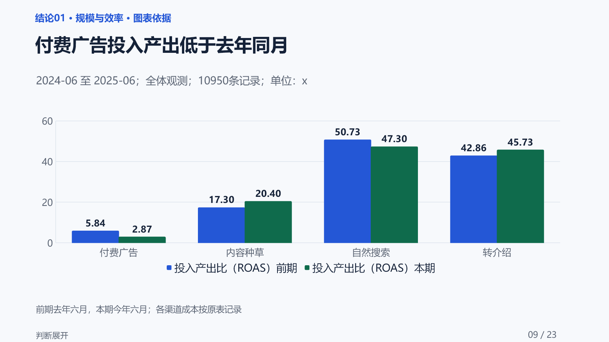
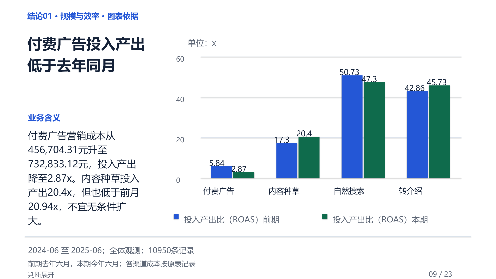

# 数据分析&汇报小助手

[English](README.md)

**把一张业务表，变成有判断、有依据、能汇报的经营简报。**


`sheet-to-report` 面向运营、销售、产品及业务负责人。提供一张结构清晰的 Excel／CSV 和汇报目标，由 AI 检查口径、寻找重点、补查依据、组织结论与行动建议，适合周报、月报、活动复盘和阶段经营汇报。

> **第一次使用：** 把文件交给能够读取文件并运行本地 Python 的 AI 工具，然后说“请用 sheet-to-report 分析这份表，面向业务负责人做月度复盘，先生成 HTML”。用户不需要编写代码或配置 JSON；影响结论的口径不清时，Agent 会再向你确认。

[在线看完整案例](https://majichuan.github.io/sheet-to-report/) · [三步开始](QUICKSTART.zh-CN.md) · [常见问题](FAQ.md) · [安装与环境](INSTALL.md)

## 先看实际效果

公开演示采用完全合成的 10 万行全渠道经营数据，覆盖 18 个月、11 个字段，不包含真实企业或个人信息。

**[在线查看完整案例展示](https://majichuan.github.io/sheet-to-report/)** · [阅读完整 HTML 分析简报](https://majichuan.github.io/sheet-to-report/report.html) · [查看案例说明](DEMO.zh-CN.md)

下面两张图使用同一条结论和同一组数据。标准版保留直接可编辑的图表与文字；可选的 SlideViber 美化版在不遗漏重要信息的前提下，重新组织构图和视觉层级。

| 可编辑标准版 | 可选 SlideViber 美化版 |
| --- | --- |
|  |  |

在线案例增加了四组同页对照，并提供两套完整23页样例：[下载可编辑标准版 PPTX](https://majichuan.github.io/sheet-to-report/downloads/sheet-to-report-demo-standard.pptx)，或[下载 SlideViber 美化版 PPTX](https://majichuan.github.io/sheet-to-report/downloads/sheet-to-report-demo-slideviber.pptx)。

## 你能拿到什么

| 产物 | 适合怎么用 |
| --- | --- |
| **HTML 分析简报** | 看整体表现、重点判断、图表与行动；通过导航和证据链接查看依据，单文件可离线阅读 |
| **标准汇报 PPT** | 用可编辑的汇报页讲清概况、结论、支撑依据与下一步，页面指引让听众跟上主线 |
| **SlideViber 美化 PPT（可选）** | 沿用标准稿内容，进一步设计演示构图；另存美化版，保留标准稿和完整信息 |

## 它解决的主要问题

- **从业务问题出发：** 先确认表的语义、指标口径和汇报目标，再决定分析什么，不机械套固定模板。
- **结论能够追溯：** 重要数字保留周期、筛选、口径和证据关系；证据不足就缩小结论或说明限制。
- **图表服务判断：** 根据趋势、比较、结构、分布、关系或过程选择图表，并检查图表是否真的支撑结论。
- **行动能够验证：** 建议写清实际对象或角色、具体做法、验证信号和停止边界。
- **三版同源：** HTML、标准 PPT 与可选美化版共享分析模型和数值依据，美化不能改数字或漏信息。

## 安装

可用兼容 Agent Skills 的安装器直接从 GitHub 安装：

```bash
npx skills add https://github.com/majichuan/sheet-to-report --skill sheet-to-report
```

也可以在 [skills.sh 公开详情页](https://skills.sh/majichuan/sheet-to-report/sheet-to-report)查看安装入口和累计安装量。

也可以下载 GitHub Release 的 ZIP，或把仓库复制到所用 AI 工具支持的 Skill 目录。请保持 `SKILL.md`、`references/`、`scripts/` 和 `assets/` 的相对结构完整。

在 Skill 根目录检查基础环境：

```bash
python --version
python scripts/environment_check.py --target html
```

完整依赖和 PPT 说明见[安装与使用说明](INSTALL.md)。

## 怎么开始

把文件交给支持本地脚本执行的 AI 工具，例如这样说：

> 请用 sheet-to-report 分析这份 Excel，面向业务负责人做月度复盘。说明整体表现、主要变化、机会风险和下一步建议。先生成 HTML；如果需要 PPT，请先给我两页真实风格小样。

可以选择**直接分析**，或**先确认分析方案**。生成 PPT 前，未指定风格时先看真实小样；明确让 AI 代选时，默认“清晰商务”。标准稿完成后，可自行选择是否安装并使用 [SlideViber](https://github.com/tf71991/slideviber-skill) 继续美化。

遇到环境、工作表、指标口径或平台模型错误时，先看[常见问题](FAQ.md)。HTML、标准 PPT 与美化版按阶段生成，后续阶段失败时应保留已经通过的产物。

## 本地试用合成数据

```bash
python scripts/generate_sample.py --output-dir generated-sample --write-xlsx
python scripts/sheet_to_report.py --inspect generated-sample/synthetic-business.xlsx
```

检查命令只负责生成样例和读取字段；正式结论、HTML 与 PPT 仍由 Agent 按 `SKILL.md` 的分析链路生成。

## 当前边界

- 当前版本以中文业务场景为主；英文产出尚未完成同等验收。
- 每次处理一张结构清晰的 Excel／CSV；多表联合、数据库接入和后台定时运行不属于 v0.2。
- AI 工具须能读取文件并运行本地 Python；PPT 另需 Node.js 与 `python-pptx`，详见安装说明。
- 不绑定任何案例，不套用模拟案例的结论；样例数据由脚本本地生成。
- 不用于医疗、投资、授信、人事评价等高风险决策。

提交问题前，请先删除或替换真实业务与个人数据。参与方式见 [CONTRIBUTING.md](CONTRIBUTING.md)，安全问题见 [SECURITY.md](SECURITY.md)。

## 许可

本项目采用 [MIT License](LICENSE)。第三方与合成数据说明见 [NOTICE.md](NOTICE.md)。
